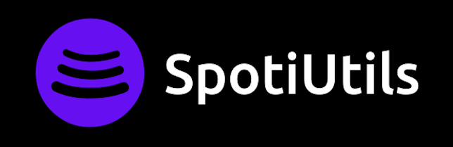

<h1 align="center">
<a href="https://spotiutils.herokuapp.com/">
  
  </a>
</h1>

<h1 align="center">
    <a href="https://spotiutils.herokuapp.com/">🔗 SpotiUtils</a>
</h1>

<p align="center">🚀Website project to convert a Spotify to Youtube playlist</p>

<p align="center">
 <a href="#features">Features</a> •
 <a href="#setup">Setup</a> • 
 <a href="#built-with">Built With</a> • 
 <a href="#author">Author</a>
</p>

<p align="center">
    
</p>

*Read this in other languages: [Portuguese](README.pt.md)*

#### Features

- [x] Login with Spotify
- [x] Convert a Spotify playlist to Youtube
- [x] Get a random song
- [x] Check your Spotify Stats:
    - Most listened artists
    - Most listened tracks


## Setup

These instructios will get you a copy of the project up and running on your local machine. 

#### Create database

Follow the instructions to get the mongodb connection link: [here](https://www.mongodb.com/docs/atlas/tutorial/deploy-free-tier-cluster/).

#### Create and manage an Spotify APP

Create an app to get the envoiroments variable: [here](https://developer.spotify.com/dashboard/)
You have to set ```http://localhost:3001/auth/spotify/callback``` as redirect URL in the Spotify dashboard


#### Installing

 *If you already have the Node.js and npm installed, you can skip the step below.*
 

**Installing Node.js and npm**

To run the App, you'll need to have the Node.js and  npm installed on your machine, if you don't have Node.js and npm installed yet, you can follow the following steps to install both:

 * Installing Node.js and npm on macOS and Windows environment: [here](https://nodejs.org/en/download/).
 * Installing Node.js and npm on Ubuntu environment: [here](https://tecadmin.net/install-latest-nodejs-npm-on-ubuntu/).

 **Fill .env file with your variables**
```
DATABASE_URL=<mongodb connection link>
DOMAIN=http://localhost:3001
REACT_APP_DOMAIN=$DOMAIN
SPOTIFY_CLIENT_ID=<spotify api client id>
SPOTIFY_CLIENT_SECRET=<spotify api client secret>
SPOTIFY_CALLBACK=/auth/spotify/callback
SECRET=<generate a secret to hash user sessions>
```


#### Running the App

**Cloning the repository**
```
$ git clone https://github.com/mauriciosoaresd/SpotiUtils && cd SpotiUtils
```

**Installing project dependencies**
```
$ npm install
```

After cloning the repository and enter on the directory, you just need to run the following commands:

**Building Project**
```
npm run build
```

**Running the Express Server**
```
$ node server.js
```

You can access server by the port:3001 - <http://localhost:3001>

### Built With

- [Node.js](https://nodejs.org/en/)
- [React](https://reactjs.org/)
- [Bootstrap](https://getbootstrap.com/)
- [MongoDB](https://www.mongodb.com/)
- [PassportJS](https://www.passportjs.org/)
- [Redux](https://redux.js.org/)

### Author
 

 <sub><b>Maurício Domingues</b></sub>

 [](mailto:mauriciosoaresd@gmail.com) [](https://www.linkedin.com/in/mauriciosdomingues/) 


## License

This project is under the license [MIT](./LICENSE).