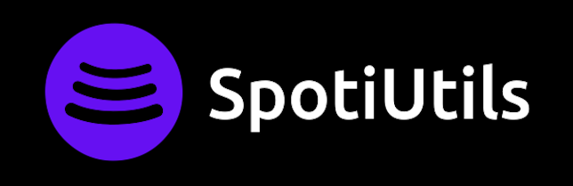

<h1 align="center">
<a href="https://spotiutils.herokuapp.com/">
  
  </a>
</h1>

<h1 align="center">
    <a href="https://spotiutils.herokuapp.com/">🔗 SpotiUtils</a>
</h1>


<p align="center">🚀Projeto de website para conversão de playlist Spotify para Youtube</p>

<p align="center">
 <a href="#funcionalidades">Funcionalidades</a> •
 <a href="#configurar">Configurar</a> • 
 <a href="#feito-com">Feito com</a> • 
 <a href="#autor">Autor</a>
</p>

<p align="center">
    
</p>

*Leia em outros idiomas: [English](README.md)

#### Funcionalidades

- [x] Login com Spotify
- [x] Converter uma playlist Spotify para Youtube
- [x] Receba uma música aleatória
- [x] Veja suas estatísticas do Spotify
    - Artistas mais ouvidos
    - Músicas mais ouvidas


## Configurar

Estas instruções te darão uma cópia do projeto rodando na sua maquina local 

#### Criar banco de dados

Siga as instruções para conseguir o link de conexão com o mongoDB: [here](https://patrociniomaia.wordpress.com/2020/12/22/criando-um-cluster-no-mongodb-atlas-for-free/).

#### Crie e configure um Spotify App

Crie um app para conseguir as variáveis de ambiente: [here](https://developer.spotify.com/dashboard/)
Você deve configurar ```http://localhost:3001/auth/spotify/callback``` como URL de redirecionamento do Spotify dashboard


#### Instalando

 *Se você já tem Node.js e npm instalados pule esta parte.*


**Instalando Node.js e npm**

Para rodar o App você deverá ter Node.js e npm instalados na sua máquina. Siga os passos abaixo para instalar ambos:

 * Instalação do Node.js e npm no macOs e Windows: [here](https://nodejs.org/pt-br/download/)
 * Instalação do Node.js e npm no Ubuntu: [here](https://www.digitalocean.com/community/tutorials/how-to-install-node-js-on-ubuntu-20-04-pt)

 **Preencha o arquivo .env com suas variáveis**
```
DATABASE_URL=<link de conexão do mongoDB>
DOMAIN=http://localhost:3001
REACT_APP_DOMAIN=$DOMAIN
SPOTIFY_CLIENT_ID=<client ID da api spotify>
SPOTIFY_CLIENT_SECRET=<client secret da api spotify>
SPOTIFY_CALLBACK=/auth/spotify/callback
SECRET=<gere uma senha para codificar as sessões de usuários>
```


#### Rodando o App

**Clonando o repositório**
```
$ git clone https://github.com/mauriciosoaresd/SpotiUtils && cd SpotiUtils
```

**Instalando as dependências do projeto**
```
$ npm install
```

Após clonar o repositório e entrar em sua pasta, rode as linhas de terminal abaixo: 

**Compilar projeto**
```
npm run build
```

**Rodar servidor Express**
```
$ node server.js
```
Você pode acessar o servidor pela porta:3001 - <http://localhost:3001>

### Feito com

- [Node.js](https://nodejs.org/pt-br/)
- [React](https://pt-br.reactjs.org/)
- [Bootstrap](https://getbootstrap.com.br/)
- [MongoDB](https://www.mongodb.com/pt-br)
- [PassportJS](https://www.passportjs.org/)
- [Redux](https://redux.js.org/)

### Autor
 

 <sub><b>Maurício Domingues</b></sub>

 [](mailto:mauriciosoaresd@gmail.com) [](https://www.linkedin.com/in/mauriciosdomingues/) 


## License

Este projeto está licenciado nos termos da licença [MIT](./LICENSE).